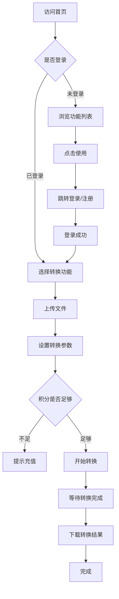
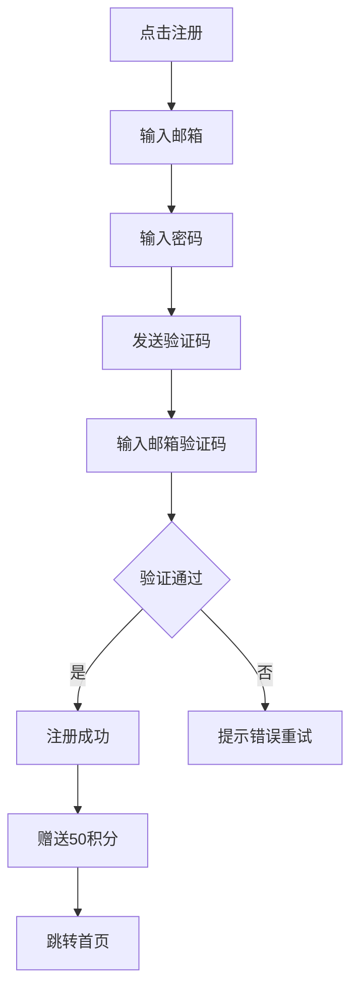
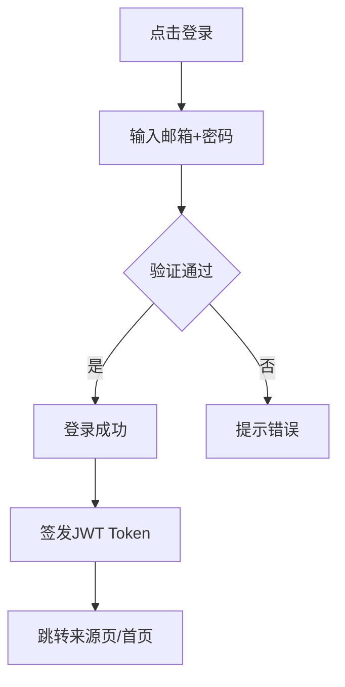
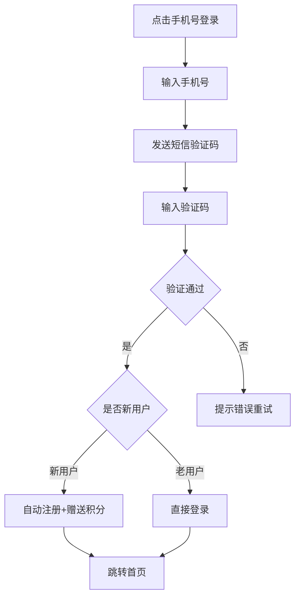
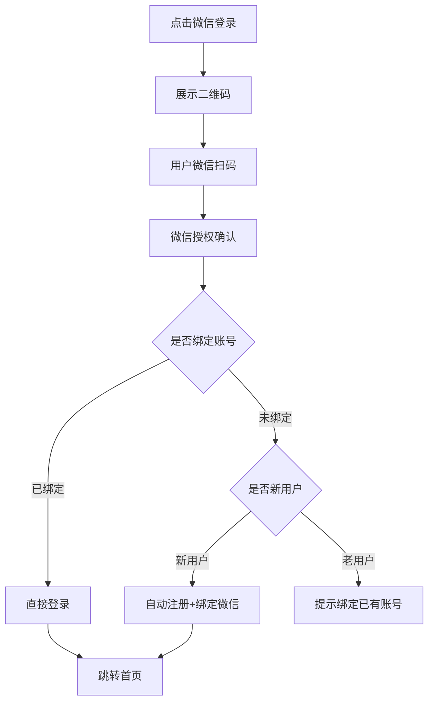
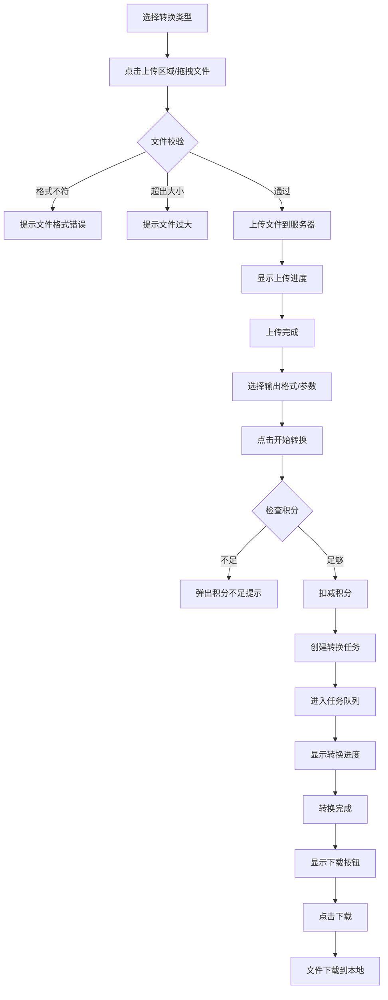
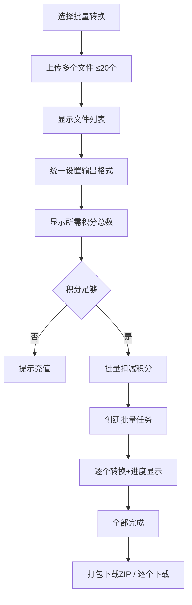
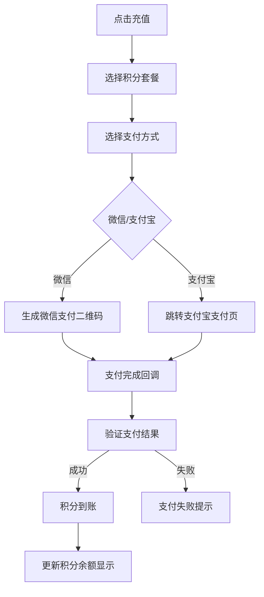
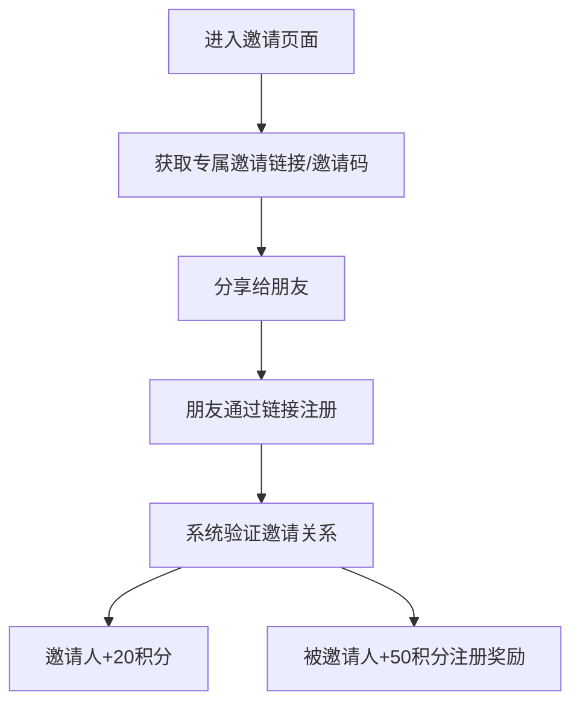
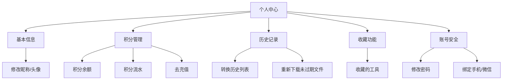

# FileShift 用户流程文档

## 1. 核心用户流程

### 1.1 总体流程概览



---

## 2. 注册登录流程

### 2.1 邮箱注册



### 2.2 邮箱登录



### 2.3 手机号登录（阶段5）



### 2.4 微信扫码登录（阶段5）



---

## 3. 文件转换流程

### 3.1 单文件转换



### 3.2 批量文件转换



### 3.3 文件转换状态机

```
待上传 → 上传中 → 已上传 → 排队中 → 转换中 → 转换成功 → 已下载
                                              ↓
                                         转换失败 → 可重试(不扣积分)
```

---

## 4. 积分相关流程

### 4.1 积分获取途径

| 途径       | 积分数量 | 条件               |
| ---------- | -------- | ------------------ |
| 新用户注册 | +50      | 一次性             |
| 邀请新用户 | +20 / 人 | 被邀请人完成注册   |
| 购买积分包 | 按套餐   | 支付成功后即时到账 |

### 4.2 积分充值流程



### 4.3 邀请流程



---

## 5. 个人中心流程

### 5.1 用户中心功能



### 5.2 历史记录

| 字段     | 说明                       |
| -------- | -------------------------- |
| 文件名   | 原始文件名称               |
| 转换类型 | 如 PDF→Word                |
| 状态     | 成功/失败/进行中           |
| 消耗积分 | 本次操作消耗               |
| 创建时间 | 任务创建时间               |
| 操作     | 重新下载(24h内) / 再次转换 |

---

## 6. 页面导航结构

```
首页 (/)
├── 文档转换 (/tools/document)
│   ├── PDF转Word (/tools/document/pdf-to-word)
│   ├── Word转PDF (/tools/document/word-to-pdf)
│   └── ...
├── 图片转换 (/tools/image)
│   ├── PNG转JPG (/tools/image/png-to-jpg)
│   ├── 图片压缩 (/tools/image/compress)
│   └── ...
├── 音视频 (/tools/media)
│   ├── MP4转AVI (/tools/media/mp4-to-avi)
│   ├── 视频压缩 (/tools/media/compress)
│   └── ...
├── 小工具 (/tools/utility)
│   ├── PDF合并 (/tools/utility/pdf-merge)
│   ├── OCR识别 (/tools/utility/ocr)
│   └── ...
├── 定价 (/pricing)
├── 登录 (/auth/login)
├── 注册 (/auth/register)
└── 个人中心 (/dashboard)
    ├── 概览 (/dashboard)
    ├── 历史记录 (/dashboard/history)
    ├── 积分管理 (/dashboard/credits)
    ├── 邀请好友 (/dashboard/invite)
    └── 账号设置 (/dashboard/settings)
```

---

## 7. 异常流程处理

| 异常场景          | 处理方式                             |
| ----------------- | ------------------------------------ |
| 文件上传中断      | 显示上传失败，提供重试按钮           |
| 转换超时          | 标记为失败，不扣积分，提示用户重试   |
| 转换失败          | 不扣积分，显示失败原因，提供重试选项 |
| 积分不足          | 阻止操作，引导充值页面               |
| 文件已过期(超24h) | 提示文件已清理，建议重新转换         |
| 网络断开          | 前端检测后提示，恢复后自动重连       |
| 服务器维护        | 显示维护页面，预计恢复时间           |
| Token过期         | 自动刷新Token，刷新失败跳转登录      |
