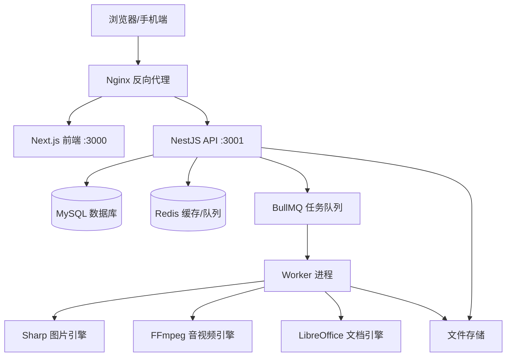
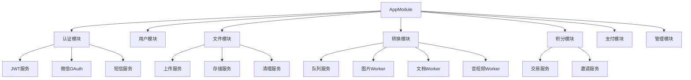

# FileShift 系统架构设计

## 1. 总体架构

### 1.1 架构概览



### 1.2 架构分层

| 层级   | 组件              | 职责                                |
| ------ | ----------------- | ----------------------------------- |
| 接入层 | Nginx             | 反向代理、HTTPS、静态资源、负载均衡 |
| 展示层 | Next.js           | SSR/CSR页面渲染、用户交互、文件上传 |
| 网关层 | NestJS Controller | 路由分发、参数校验、身份认证        |
| 业务层 | NestJS Service    | 业务逻辑、积分管理、任务调度        |
| 队列层 | BullMQ + Redis    | 异步任务排队、优先级管理、重试机制  |
| 执行层 | Worker进程        | 文件转换执行、引擎调用、结果处理    |
| 数据层 | MySQL + Redis     | 持久化存储、缓存、会话管理          |
| 存储层 | 本地/COS/OSS      | 文件存储、CDN分发                   |

---

## 2. 模块划分

### 2.1 后端模块结构



### 2.2 模块职责说明

| 模块             | 职责     | 核心接口                           |
| ---------------- | -------- | ---------------------------------- |
| AuthModule       | 认证鉴权 | 登录、注册、Token刷新、第三方OAuth |
| UserModule       | 用户管理 | 用户信息CRUD、密码修改、账号绑定   |
| FileModule       | 文件处理 | 上传、下载、存储策略、过期清理     |
| ConversionModule | 格式转换 | 创建任务、状态查询、Worker调度     |
| CreditModule     | 积分管理 | 积分扣减、充值、流水查询、邀请奖励 |
| PaymentModule    | 支付对接 | 创建订单、回调处理、退款           |
| AdminModule      | 后台管理 | 用户管理、数据统计、系统配置       |

---

## 3. 数据流设计

### 3.1 文件转换核心数据流

```
用户上传文件
    │
    ▼
[API Server] 文件校验 → 存储到临时目录 → 返回fileId
    │
    ▼
[API Server] 检查积分 → 扣减积分(事务) → 创建任务记录
    │
    ▼
[BullMQ] 任务入队 → 按类型分配到对应队列(image/document/media)
    │
    ▼
[Worker] 消费任务 → 调用转换引擎 → 生成输出文件
    │
    ▼
[Worker] 更新任务状态 → 存储输出文件 → 生成下载链接
    │
    ▼
[前端] WebSocket/轮询获取状态 → 显示下载按钮
    │
    ▼
[用户] 点击下载 → 服务端验权 → 返回文件流
    │
    ▼
[定时任务] 24h后清理临时文件和输出文件
```

### 3.2 积分流转数据流

```
积分来源:
  注册赠送 ──┐
  邀请奖励 ──┼──▶ credit_transactions 表 ──▶ 更新 user_credits 余额
  购买充值 ──┘                                       │
                                                     ▼
积分消耗:                                     余额校验
  转换扣减 ──────────────────────────────────▶ 扣减(事务)
                                                     │
                                              转换失败回滚
```

---

## 4. 技术选型详情

### 4.1 前端技术栈

| 技术           | 版本   | 用途                   |
| -------------- | ------ | ---------------------- |
| Next.js        | 14+    | React框架，SSR/SSG支持 |
| React          | 18+    | UI组件库               |
| TypeScript     | 5+     | 类型安全               |
| TailwindCSS    | 3+     | 原子化CSS              |
| shadcn/ui      | latest | 组件库（基于Radix UI） |
| Zustand        | 4+     | 状态管理               |
| React Query    | 5+     | 数据请求管理           |
| Axios          | 1+     | HTTP客户端             |
| React Dropzone | 14+    | 文件拖拽上传           |
| Framer Motion  | 10+    | 动画效果               |

### 4.2 后端技术栈

| 技术            | 版本  | 用途              |
| --------------- | ----- | ----------------- |
| NestJS          | 10+   | Node.js企业级框架 |
| TypeORM         | 0.3+  | ORM数据库操作     |
| BullMQ          | 5+    | 任务队列          |
| Passport        | 0.7+  | 认证策略          |
| Sharp           | 0.33+ | 图片处理          |
| fluent-ffmpeg   | 2+    | 音视频处理        |
| pdf-lib         | 1+    | PDF操作           |
| Multer          | 1+    | 文件上传          |
| class-validator | 0.14+ | 参数校验          |
| Swagger         | 7+    | API文档           |

### 4.3 基础设施

| 技术        | 版本  | 用途             |
| ----------- | ----- | ---------------- |
| MySQL       | 8.0+  | 主数据库         |
| Redis       | 7.0+  | 缓存 + 队列存储  |
| Docker      | 24+   | 容器化           |
| Nginx       | 1.24+ | 反向代理         |
| FFmpeg      | 6+    | 音视频编解码     |
| LibreOffice | 7+    | 文档转换引擎     |
| pnpm        | 8+    | 包管理           |
| Turborepo   | 1+    | Monorepo构建编排 |

---

## 5. 通信方式

### 5.1 前后端通信

| 场景     | 方式                     | 说明                   |
| -------- | ------------------------ | ---------------------- |
| 常规接口 | REST API                 | JSON格式，统一响应结构 |
| 文件上传 | multipart/form-data      | Multer处理             |
| 转换进度 | SSE (Server-Sent Events) | 服务端推送进度更新     |
| 实时通知 | WebSocket (备选)         | 如需更复杂的实时交互   |

### 5.2 统一响应格式

```typescript
// 成功响应
{
  "code": 0,
  "message": "success",
  "data": { ... }
}

// 错误响应
{
  "code": 10001,
  "message": "积分不足",
  "data": null
}

// 分页响应
{
  "code": 0,
  "message": "success",
  "data": {
    "list": [...],
    "total": 100,
    "page": 1,
    "pageSize": 20
  }
}
```

---

## 6. 部署架构

### 6.1 本地开发

```
本地机器
├── Next.js (hot reload)     :3000
├── NestJS (hot reload)      :3001
├── Worker进程 (热重载)
└── Docker
    ├── MySQL                :3306
    └── Redis                :6379
```

### 6.2 生产环境

```
云服务器 (2核4G起)
├── Nginx                    :80/:443
├── Docker Compose
│   ├── next-web             :3000
│   ├── nest-api             :3001
│   ├── worker (1-2实例)
│   ├── mysql                :3306
│   └── redis                :6379
└── 外部服务
    ├── 腾讯云COS (文件存储)
    ├── 腾讯云CDN (静态加速)
    └── 域名 + HTTPS证书
```

---

## 7. 扩展性设计

### 7.1 水平扩展策略

| 组件       | 扩展方式                   | 触发条件       |
| ---------- | -------------------------- | -------------- |
| API Server | 增加实例 + Nginx负载均衡   | QPS > 500      |
| Worker     | 增加Worker进程/容器        | 队列积压 > 100 |
| MySQL      | 主从复制 / 云数据库        | 连接数 > 200   |
| Redis      | 集群模式                   | 内存 > 2GB     |
| 文件存储   | 已使用对象存储，天然可扩展 | -              |

### 7.2 功能扩展设计

转换引擎采用策略模式，新增格式只需：

1. 实现 `ConversionStrategy` 接口
2. 注册到策略工厂
3. 配置积分消耗（constants包）
4. 前端添加入口页面

```typescript
// 转换策略接口
interface ConversionStrategy {
  supports(input: FileType, output: FileType): boolean;
  convert(inputPath: string, outputPath: string, options?: any): Promise<ConversionResult>;
  estimateTime(fileSize: number): number;
}
```
