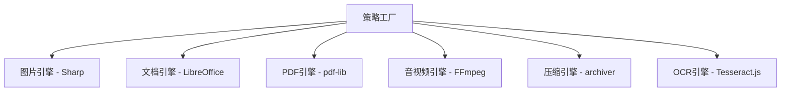

# FileShift 转换引擎设计

## 1. 引擎架构

### 1.1 策略模式设计

所有转换操作统一实现 `ConversionStrategy` 接口，通过工厂模式分发：

```typescript
// 转换策略接口
interface ConversionStrategy {
  // 是否支持该转换类型
  supports(inputType: string, outputType: string): boolean;

  // 执行转换
  convert(input: ConvertInput): Promise<ConvertOutput>;

  // 预估耗时(秒)
  estimateTime(fileSize: number): number;

  // 校验输入文件
  validate(filePath: string): Promise<ValidationResult>;
}

interface ConvertInput {
  inputPath: string; // 输入文件路径
  outputPath: string; // 输出文件路径
  options?: Record<string, any>; // 转换参数
  onProgress?: (percent: number) => void; // 进度回调
}

interface ConvertOutput {
  success: boolean;
  outputPath: string;
  outputSize: number;
  duration: number; // 耗时(ms)
  metadata?: Record<string, any>; // 额外信息
}
```

### 1.2 引擎分类



---

## 2. 图片转换引擎 (Sharp)

### 2.1 技术选型理由

- **性能**: 基于libvips，比ImageMagick快4-5倍
- **内存**: 流式处理，内存占用低
- **格式**: 支持 JPEG/PNG/WebP/GIF/AVIF/TIFF/SVG
- **功能**: 转换/压缩/裁剪/旋转/水印全覆盖

### 2.2 支持的操作

| 操作     | 实现方式                               | 备注                       |
| -------- | -------------------------------------- | -------------------------- |
| 格式转换 | `sharp(input).toFormat(format)`        | PNG/JPG/WebP/GIF/TIFF/AVIF |
| HEIC转换 | `sharp(input).jpeg()`                  | 需安装 sharp 的 HEIF 支持  |
| 图片压缩 | `.jpeg({quality})` / `.png({quality})` | quality: 1-100             |
| 图片裁剪 | `.extract({left, top, width, height})` | 指定区域裁剪               |
| 图片旋转 | `.rotate(angle)`                       | 支持任意角度               |
| 添加水印 | `.composite([{input: watermark}])`     | 图片/文字水印              |
| 图片拼接 | 多图composite                          | 横向/纵向拼接              |
| 生成ICO  | sharp → png-to-ico                     | 先转PNG再转ICO             |
| 调整尺寸 | `.resize(width, height, options)`      | 支持多种fit模式            |

### 2.3 关键配置

```typescript
// Sharp 全局配置
sharp.cache({ files: 20, memory: 200 }); // 缓存限制
sharp.concurrency(4); // 并发线程数
sharp.simd(true); // 启用SIMD加速
```

### 2.4 错误处理

- 格式不支持 → 返回明确错误信息
- 文件损坏 → try-catch捕获，标记任务失败
- 内存溢出 → 限制单图最大尺寸（10000x10000px）

---

## 3. 文档转换引擎 (LibreOffice)

### 3.1 技术选型理由

- **免费开源**: 无许可费用
- **格式覆盖**: PDF/Word/Excel/PPT/HTML全支持
- **Headless模式**: 无需GUI，命令行调用

### 3.2 调用方式

```typescript
import { execFile } from 'child_process';

async function convertDocument(
  inputPath: string,
  outputFormat: string,
  outputDir: string,
): Promise<string> {
  const args = ['--headless', '--convert-to', outputFormat, '--outdir', outputDir, inputPath];

  await execFileAsync('libreoffice', args, {
    timeout: 120000, // 2分钟超时
    env: { HOME: '/tmp' }, // 避免锁冲突
  });

  return path.join(outputDir, `${basename}.${outputFormat}`);
}
```

### 3.3 支持的转换

| 输入  | 输出       | 命令参数                                |
| ----- | ---------- | --------------------------------------- |
| PDF   | Word(docx) | `--convert-to docx`                     |
| Word  | PDF        | `--convert-to pdf`                      |
| Excel | PDF        | `--convert-to pdf`                      |
| PPT   | PDF        | `--convert-to pdf`                      |
| PDF   | Excel      | `--convert-to xlsx` (需配合pdf表格识别) |
| Word  | HTML       | `--convert-to html`                     |

### 3.4 性能优化

- **实例池**: 预启动2-3个LibreOffice实例，避免冷启动
- **超时控制**: 单任务最大120秒
- **隔离执行**: 每个任务使用独立的用户配置目录
- **内存限制**: 单进程最大512MB

### 3.5 已知限制

- 复杂排版转换可能丢失格式
- 特殊字体需要在服务器预安装
- PDF→Word 质量取决于PDF结构化程度

---

## 4. PDF工具引擎 (pdf-lib)

### 4.1 技术选型理由

- **纯JavaScript**: 无系统依赖，跨平台
- **功能丰富**: 合并/拆分/加密/水印/提取
- **性能好**: 直接操作PDF二进制结构

### 4.2 支持的操作

```typescript
import { PDFDocument, rgb, StandardFonts } from 'pdf-lib';

// PDF合并
async function mergePDFs(files: Buffer[]): Promise<Buffer> {
  const merged = await PDFDocument.create();
  for (const file of files) {
    const doc = await PDFDocument.load(file);
    const pages = await merged.copyPages(doc, doc.getPageIndices());
    pages.forEach(page => merged.addPage(page));
  }
  return Buffer.from(await merged.save());
}

// PDF拆分
async function splitPDF(file: Buffer, ranges: [number, number][]): Promise<Buffer[]> { ... }

// PDF加密
async function encryptPDF(file: Buffer, password: string): Promise<Buffer> { ... }

// PDF加水印
async function addWatermark(file: Buffer, text: string): Promise<Buffer> { ... }
```

### 4.3 PDF→图片

使用 pdf-to-img (基于pdf.js) 将PDF每页渲染为图片：

```typescript
import { pdf } from 'pdf-to-img';

async function pdfToImages(pdfPath: string, outputDir: string) {
  const document = await pdf(pdfPath, { scale: 2.0 });
  let pageNum = 1;
  for await (const image of document) {
    fs.writeFileSync(`${outputDir}/page-${pageNum}.png`, image);
    pageNum++;
  }
}
```

---

## 5. 音视频引擎 (FFmpeg)

### 5.1 技术选型理由

- **工业标准**: 几乎支持所有音视频格式
- **性能卓越**: C语言实现，硬件加速支持
- **功能完整**: 转码/裁剪/压缩/水印/提取音频

### 5.2 Node.js集成

使用 `fluent-ffmpeg` 封装：

```typescript
import ffmpeg from 'fluent-ffmpeg';

// 视频格式转换
function convertVideo(input: string, output: string, options: VideoOptions): Promise<void> {
  return new Promise((resolve, reject) => {
    ffmpeg(input)
      .output(output)
      .videoCodec(options.codec || 'libx264')
      .audioCodec('aac')
      .on('progress', (progress) => {
        options.onProgress?.(Math.round(progress.percent));
      })
      .on('end', resolve)
      .on('error', reject)
      .run();
  });
}

// 视频压缩
function compressVideo(input: string, output: string, options: CompressOptions): Promise<void> {
  return new Promise((resolve, reject) => {
    ffmpeg(input)
      .output(output)
      .videoBitrate(options.bitrate || '1000k')
      .size(options.resolution || '1280x720')
      .fps(options.fps || 30)
      .on('progress', (progress) => {
        options.onProgress?.(Math.round(progress.percent));
      })
      .on('end', resolve)
      .on('error', reject)
      .run();
  });
}

// 提取音频
function extractAudio(input: string, output: string): Promise<void> {
  return new Promise((resolve, reject) => {
    ffmpeg(input)
      .output(output)
      .noVideo()
      .audioCodec('libmp3lame')
      .on('end', resolve)
      .on('error', reject)
      .run();
  });
}
```

### 5.3 支持的操作

| 操作     | FFmpeg参数                  | 说明          |
| -------- | --------------------------- | ------------- |
| 视频转码 | `-c:v libx264 -c:a aac`     | 通用H264+AAC  |
| 视频压缩 | `-b:v 1000k -s 1280x720`    | 码率+分辨率   |
| 音频转码 | `-c:a libmp3lame -b:a 192k` | 音频格式转换  |
| 提取音频 | `-vn -c:a libmp3lame`       | 去视频留音频  |
| 视频裁剪 | `-ss 00:01:00 -t 00:00:30`  | 时间段裁剪    |
| 视频截图 | `-ss 00:00:05 -frames:v 1`  | 指定时间截图  |
| GIF制作  | `-vf "fps=10,scale=320:-1"` | 视频转GIF     |
| 加水印   | `-vf "drawtext=..."`        | 文字/图片水印 |

### 5.4 进度回调

FFmpeg通过 stderr 输出进度信息，fluent-ffmpeg 解析后通过 `progress` 事件回调。

### 5.5 超时与资源控制

- 单任务最大300秒(5分钟)
- 输入文件最大100MB(付费用户)
- 并发数限制为2（CPU密集）

---

## 6. 压缩引擎

### 6.1 archiver (ZIP)

```typescript
import archiver from 'archiver';

function createZip(files: string[], outputPath: string): Promise<void> {
  const output = fs.createWriteStream(outputPath);
  const archive = archiver('zip', { zlib: { level: 9 } });
  archive.pipe(output);
  files.forEach((file) => archive.file(file, { name: path.basename(file) }));
  return archive.finalize();
}
```

### 6.2 解压

```typescript
import extract from 'extract-zip';

async function unzip(zipPath: string, outputDir: string): Promise<void> {
  await extract(zipPath, { dir: outputDir });
}
```

---

## 7. OCR引擎 (Tesseract.js)

```typescript
import Tesseract from 'tesseract.js';

async function recognizeText(imagePath: string, lang = 'chi_sim+eng'): Promise<string> {
  const {
    data: { text },
  } = await Tesseract.recognize(imagePath, lang, {
    logger: (info) => {
      if (info.status === 'recognizing text') {
        onProgress?.(Math.round(info.progress * 100));
      }
    },
  });
  return text;
}
```

### 7.1 语言支持

- `eng` - 英文
- `chi_sim` - 简体中文
- `chi_tra` - 繁体中文
- 组合使用：`chi_sim+eng`

---

## 8. 错误处理与重试

### 8.1 统一错误分类

| 错误类型 | 是否重试    | 是否退积分  | 示例           |
| -------- | ----------- | ----------- | -------------- |
| 输入错误 | 否          | 是          | 文件格式不支持 |
| 转换错误 | 是(最多3次) | 3次失败后退 | 引擎内部错误   |
| 超时错误 | 是(最多2次) | 2次失败后退 | 处理超时       |
| 系统错误 | 是(最多3次) | 3次失败后退 | OOM/磁盘满     |

### 8.2 重试策略

- 指数退避：第1次5秒后重试，第2次25秒后，第3次125秒后
- 重试时不重复扣积分
- 3次全部失败 → 进入死信队列 → 退还积分

---

## 9. 性能基准

| 操作           | 文件大小 | 目标耗时 |
| -------------- | -------- | -------- |
| PNG→JPG        | 5MB      | < 1s     |
| 图片压缩       | 10MB     | < 2s     |
| PDF→Word(5页)  | 2MB      | < 10s    |
| PDF→Word(50页) | 20MB     | < 60s    |
| MP4→AVI(30s)   | 50MB     | < 30s    |
| 视频压缩(5min) | 100MB    | < 120s   |
| OCR(单页)      | 2MB      | < 5s     |
