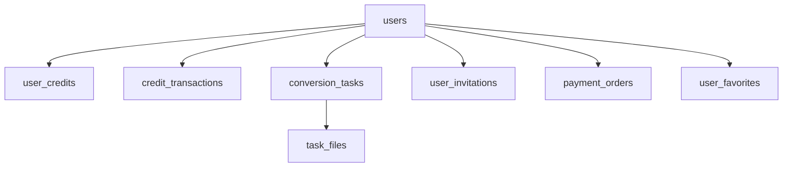

# FileShift 数据库设计

## 1. 设计原则

- 使用 MySQL 8.0，InnoDB引擎
- 所有表使用自增主键 `id` (BIGINT)
- 统一时间字段 `created_at`, `updated_at`
- 软删除使用 `deleted_at` 字段
- 字符集 utf8mb4，排序规则 utf8mb4_unicode_ci
- 金额/积分使用 INT 存储（避免浮点精度问题）

---

## 2. ER 关系图



---

## 3. 表结构设计

### 3.1 用户表 (users)

```sql
CREATE TABLE `users` (
  `id` BIGINT UNSIGNED NOT NULL AUTO_INCREMENT,
  `email` VARCHAR(255) DEFAULT NULL COMMENT '邮箱',
  `phone` VARCHAR(20) DEFAULT NULL COMMENT '手机号',
  `password_hash` VARCHAR(255) DEFAULT NULL COMMENT '密码哈希',
  `nickname` VARCHAR(50) DEFAULT NULL COMMENT '昵称',
  `avatar_url` VARCHAR(500) DEFAULT NULL COMMENT '头像URL',
  `role` ENUM('user', 'admin') DEFAULT 'user' COMMENT '角色',
  `status` ENUM('active', 'disabled', 'deleted') DEFAULT 'active' COMMENT '状态',
  `wechat_openid` VARCHAR(128) DEFAULT NULL COMMENT '微信OpenID',
  `wechat_unionid` VARCHAR(128) DEFAULT NULL COMMENT '微信UnionID',
  `invite_code` VARCHAR(20) NOT NULL COMMENT '用户邀请码(唯一)',
  `invited_by` BIGINT UNSIGNED DEFAULT NULL COMMENT '邀请人ID',
  `last_login_at` DATETIME DEFAULT NULL COMMENT '最后登录时间',
  `created_at` DATETIME NOT NULL DEFAULT CURRENT_TIMESTAMP,
  `updated_at` DATETIME NOT NULL DEFAULT CURRENT_TIMESTAMP ON UPDATE CURRENT_TIMESTAMP,
  `deleted_at` DATETIME DEFAULT NULL,
  PRIMARY KEY (`id`),
  UNIQUE KEY `uk_email` (`email`),
  UNIQUE KEY `uk_phone` (`phone`),
  UNIQUE KEY `uk_invite_code` (`invite_code`),
  UNIQUE KEY `uk_wechat_openid` (`wechat_openid`),
  KEY `idx_invited_by` (`invited_by`),
  KEY `idx_created_at` (`created_at`)
) ENGINE=InnoDB DEFAULT CHARSET=utf8mb4 COLLATE=utf8mb4_unicode_ci COMMENT='用户表';
```

### 3.2 用户积分表 (user_credits)

```sql
CREATE TABLE `user_credits` (
  `id` BIGINT UNSIGNED NOT NULL AUTO_INCREMENT,
  `user_id` BIGINT UNSIGNED NOT NULL COMMENT '用户ID',
  `balance` INT NOT NULL DEFAULT 0 COMMENT '当前积分余额',
  `total_earned` INT NOT NULL DEFAULT 0 COMMENT '累计获得积分',
  `total_spent` INT NOT NULL DEFAULT 0 COMMENT '累计消费积分',
  `created_at` DATETIME NOT NULL DEFAULT CURRENT_TIMESTAMP,
  `updated_at` DATETIME NOT NULL DEFAULT CURRENT_TIMESTAMP ON UPDATE CURRENT_TIMESTAMP,
  PRIMARY KEY (`id`),
  UNIQUE KEY `uk_user_id` (`user_id`)
) ENGINE=InnoDB DEFAULT CHARSET=utf8mb4 COLLATE=utf8mb4_unicode_ci COMMENT='用户积分表';
```

### 3.3 积分交易表 (credit_transactions)

```sql
CREATE TABLE `credit_transactions` (
  `id` BIGINT UNSIGNED NOT NULL AUTO_INCREMENT,
  `user_id` BIGINT UNSIGNED NOT NULL COMMENT '用户ID',
  `type` ENUM('register_gift', 'invite_reward', 'invite_bonus', 'purchase', 'consume', 'refund') NOT NULL COMMENT '交易类型',
  `amount` INT NOT NULL COMMENT '积分变动量(正为收入,负为支出)',
  `balance_after` INT NOT NULL COMMENT '交易后余额',
  `description` VARCHAR(255) DEFAULT NULL COMMENT '描述',
  `related_id` VARCHAR(64) DEFAULT NULL COMMENT '关联ID(任务ID/订单ID/邀请用户ID)',
  `expires_at` DATETIME DEFAULT NULL COMMENT '积分过期时间(赠送积分有效期)',
  `created_at` DATETIME NOT NULL DEFAULT CURRENT_TIMESTAMP,
  PRIMARY KEY (`id`),
  KEY `idx_user_id` (`user_id`),
  KEY `idx_type` (`type`),
  KEY `idx_created_at` (`created_at`),
  KEY `idx_expires_at` (`expires_at`)
) ENGINE=InnoDB DEFAULT CHARSET=utf8mb4 COLLATE=utf8mb4_unicode_ci COMMENT='积分交易表';
```

### 3.4 转换任务表 (conversion_tasks)

```sql
CREATE TABLE `conversion_tasks` (
  `id` BIGINT UNSIGNED NOT NULL AUTO_INCREMENT,
  `task_no` VARCHAR(32) NOT NULL COMMENT '任务编号(展示用)',
  `user_id` BIGINT UNSIGNED NOT NULL COMMENT '用户ID',
  `type` VARCHAR(50) NOT NULL COMMENT '转换类型(如pdf-to-word)',
  `category` ENUM('document', 'image', 'media', 'compress', 'tool') NOT NULL COMMENT '功能分类',
  `status` ENUM('pending', 'uploading', 'queued', 'processing', 'completed', 'failed', 'cancelled') NOT NULL DEFAULT 'pending' COMMENT '任务状态',
  `input_file_name` VARCHAR(255) NOT NULL COMMENT '原文件名',
  `input_file_path` VARCHAR(500) NOT NULL COMMENT '输入文件存储路径',
  `input_file_size` BIGINT NOT NULL COMMENT '输入文件大小(bytes)',
  `input_mime_type` VARCHAR(100) NOT NULL COMMENT '输入文件MIME类型',
  `output_file_name` VARCHAR(255) DEFAULT NULL COMMENT '输出文件名',
  `output_file_path` VARCHAR(500) DEFAULT NULL COMMENT '输出文件存储路径',
  `output_file_size` BIGINT DEFAULT NULL COMMENT '输出文件大小(bytes)',
  `credits_cost` INT NOT NULL DEFAULT 0 COMMENT '消耗积分',
  `options` JSON DEFAULT NULL COMMENT '转换参数(如质量、分辨率等)',
  `progress` TINYINT UNSIGNED DEFAULT 0 COMMENT '进度百分比(0-100)',
  `error_message` VARCHAR(500) DEFAULT NULL COMMENT '错误信息',
  `started_at` DATETIME DEFAULT NULL COMMENT '开始处理时间',
  `completed_at` DATETIME DEFAULT NULL COMMENT '完成时间',
  `expires_at` DATETIME DEFAULT NULL COMMENT '文件过期时间(24h)',
  `created_at` DATETIME NOT NULL DEFAULT CURRENT_TIMESTAMP,
  `updated_at` DATETIME NOT NULL DEFAULT CURRENT_TIMESTAMP ON UPDATE CURRENT_TIMESTAMP,
  PRIMARY KEY (`id`),
  UNIQUE KEY `uk_task_no` (`task_no`),
  KEY `idx_user_id` (`user_id`),
  KEY `idx_status` (`status`),
  KEY `idx_type` (`type`),
  KEY `idx_created_at` (`created_at`),
  KEY `idx_expires_at` (`expires_at`)
) ENGINE=InnoDB DEFAULT CHARSET=utf8mb4 COLLATE=utf8mb4_unicode_ci COMMENT='转换任务表';
```

### 3.5 用户邀请表 (user_invitations)

```sql
CREATE TABLE `user_invitations` (
  `id` BIGINT UNSIGNED NOT NULL AUTO_INCREMENT,
  `inviter_id` BIGINT UNSIGNED NOT NULL COMMENT '邀请人ID',
  `invitee_id` BIGINT UNSIGNED NOT NULL COMMENT '被邀请人ID',
  `inviter_reward` INT NOT NULL DEFAULT 20 COMMENT '邀请人获得积分',
  `invitee_reward` INT NOT NULL DEFAULT 10 COMMENT '被邀请人额外积分',
  `status` ENUM('pending', 'completed') DEFAULT 'completed' COMMENT '状态',
  `created_at` DATETIME NOT NULL DEFAULT CURRENT_TIMESTAMP,
  PRIMARY KEY (`id`),
  UNIQUE KEY `uk_invitee` (`invitee_id`),
  KEY `idx_inviter_id` (`inviter_id`)
) ENGINE=InnoDB DEFAULT CHARSET=utf8mb4 COLLATE=utf8mb4_unicode_ci COMMENT='用户邀请表';
```

### 3.6 支付订单表 (payment_orders)

```sql
CREATE TABLE `payment_orders` (
  `id` BIGINT UNSIGNED NOT NULL AUTO_INCREMENT,
  `order_no` VARCHAR(32) NOT NULL COMMENT '订单号',
  `user_id` BIGINT UNSIGNED NOT NULL COMMENT '用户ID',
  `package_name` VARCHAR(50) NOT NULL COMMENT '套餐名称',
  `credits_amount` INT NOT NULL COMMENT '积分数量',
  `amount_cents` INT NOT NULL COMMENT '支付金额(分)',
  `payment_method` ENUM('wechat', 'alipay') NOT NULL COMMENT '支付方式',
  `status` ENUM('pending', 'paid', 'failed', 'refunded', 'expired') NOT NULL DEFAULT 'pending' COMMENT '订单状态',
  `transaction_id` VARCHAR(128) DEFAULT NULL COMMENT '第三方交易号',
  `paid_at` DATETIME DEFAULT NULL COMMENT '支付时间',
  `expired_at` DATETIME DEFAULT NULL COMMENT '订单过期时间',
  `created_at` DATETIME NOT NULL DEFAULT CURRENT_TIMESTAMP,
  `updated_at` DATETIME NOT NULL DEFAULT CURRENT_TIMESTAMP ON UPDATE CURRENT_TIMESTAMP,
  PRIMARY KEY (`id`),
  UNIQUE KEY `uk_order_no` (`order_no`),
  KEY `idx_user_id` (`user_id`),
  KEY `idx_status` (`status`),
  KEY `idx_created_at` (`created_at`)
) ENGINE=InnoDB DEFAULT CHARSET=utf8mb4 COLLATE=utf8mb4_unicode_ci COMMENT='支付订单表';
```

### 3.7 验证码表 (verification_codes)

```sql
CREATE TABLE `verification_codes` (
  `id` BIGINT UNSIGNED NOT NULL AUTO_INCREMENT,
  `target` VARCHAR(255) NOT NULL COMMENT '目标(邮箱/手机号)',
  `code` VARCHAR(6) NOT NULL COMMENT '验证码',
  `type` ENUM('register', 'login', 'reset_password', 'bind') NOT NULL COMMENT '类型',
  `used` TINYINT(1) NOT NULL DEFAULT 0 COMMENT '是否已使用',
  `attempts` TINYINT UNSIGNED NOT NULL DEFAULT 0 COMMENT '尝试次数',
  `expires_at` DATETIME NOT NULL COMMENT '过期时间',
  `created_at` DATETIME NOT NULL DEFAULT CURRENT_TIMESTAMP,
  PRIMARY KEY (`id`),
  KEY `idx_target_type` (`target`, `type`),
  KEY `idx_expires_at` (`expires_at`)
) ENGINE=InnoDB DEFAULT CHARSET=utf8mb4 COLLATE=utf8mb4_unicode_ci COMMENT='验证码表';
```

### 3.8 用户收藏表 (user_favorites)

```sql
CREATE TABLE `user_favorites` (
  `id` BIGINT UNSIGNED NOT NULL AUTO_INCREMENT,
  `user_id` BIGINT UNSIGNED NOT NULL COMMENT '用户ID',
  `tool_key` VARCHAR(50) NOT NULL COMMENT '工具标识(如pdf-to-word)',
  `created_at` DATETIME NOT NULL DEFAULT CURRENT_TIMESTAMP,
  PRIMARY KEY (`id`),
  UNIQUE KEY `uk_user_tool` (`user_id`, `tool_key`)
) ENGINE=InnoDB DEFAULT CHARSET=utf8mb4 COLLATE=utf8mb4_unicode_ci COMMENT='用户收藏表';
```

---

## 4. 索引策略

### 4.1 索引设计原则

- 高频查询字段建立索引
- 组合索引遵循最左前缀原则
- 避免在频繁更新的字段上建索引
- 单表索引不超过5个

### 4.2 核心查询场景与索引匹配

| 查询场景         | 使用索引                         |
| ---------------- | -------------------------------- |
| 用户登录(邮箱)   | `uk_email`                       |
| 用户登录(手机)   | `uk_phone`                       |
| 查看转换历史     | `idx_user_id` + `idx_created_at` |
| 管理后台查看任务 | `idx_status` + `idx_created_at`  |
| 积分流水查询     | `idx_user_id` + `idx_created_at` |
| 过期文件清理     | `idx_expires_at`                 |
| 邀请关系查询     | `idx_inviter_id`                 |

---

## 5. Redis 数据设计

### 5.1 缓存策略

| Key模式                 | 类型   | TTL   | 用途          |
| ----------------------- | ------ | ----- | ------------- |
| `user:{id}:info`        | Hash   | 30min | 用户信息缓存  |
| `user:{id}:credits`     | String | 5min  | 积分余额缓存  |
| `task:{taskNo}:status`  | String | 30min | 任务状态缓存  |
| `rate:{ip}`             | String | 60s   | IP请求频率    |
| `rate:{userId}`         | String | 60s   | 用户请求频率  |
| `vcode:{target}:{type}` | String | 5min  | 验证码        |
| `session:{token}`       | String | 7d    | Refresh Token |

### 5.2 BullMQ 队列 Key

| Key                          | 用途           |
| ---------------------------- | -------------- |
| `bull:image-conversion:*`    | 图片转换队列   |
| `bull:document-conversion:*` | 文档转换队列   |
| `bull:media-conversion:*`    | 音视频转换队列 |
| `bull:file-cleanup:*`        | 文件清理队列   |

---

## 6. 数据库迁移策略

使用 TypeORM Migration 管理数据库版本：

```bash
# 生成迁移文件
pnpm --filter server typeorm migration:generate -n CreateUsersTable

# 执行迁移
pnpm --filter server typeorm migration:run

# 回滚迁移
pnpm --filter server typeorm migration:revert
```

### 迁移文件命名规范

```
{timestamp}-{description}.ts

示例：
1700000001-CreateUsersTable.ts
1700000002-CreateUserCreditsTable.ts
1700000003-CreateConversionTasksTable.ts
1700000004-CreatePaymentOrdersTable.ts
```
