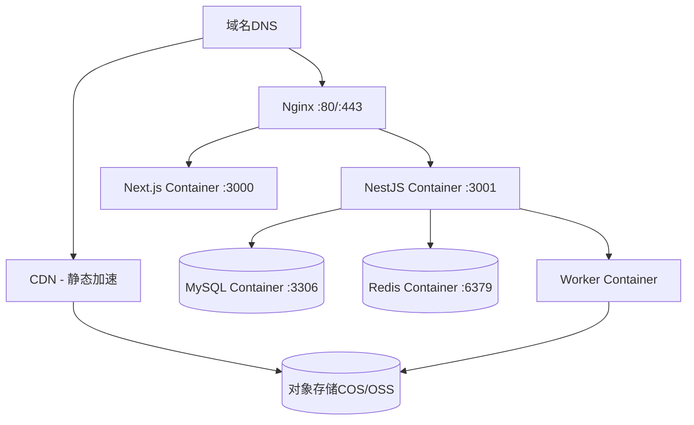

# FileShift 部署文档

## 1. 部署架构

### 1.1 生产环境架构



### 1.2 容器规划

| 容器     | 镜像基础                       | 端口   | 资源限制  |
| -------- | ------------------------------ | ------ | --------- |
| next-web | node:20-alpine                 | 3000   | 512MB RAM |
| nest-api | node:20-alpine                 | 3001   | 512MB RAM |
| worker   | node:20 + ffmpeg + libreoffice | -      | 1GB RAM   |
| mysql    | mysql:8.0                      | 3306   | 1GB RAM   |
| redis    | redis:7-alpine                 | 6379   | 256MB RAM |
| nginx    | nginx:1.24-alpine              | 80/443 | 128MB RAM |

---

## 2. Docker 配置

### 2.1 前端 Dockerfile (apps/web)

```dockerfile
# web.Dockerfile
FROM node:20-alpine AS base
RUN corepack enable && corepack prepare pnpm@latest --activate

FROM base AS deps
WORKDIR /app
COPY pnpm-lock.yaml pnpm-workspace.yaml package.json ./
COPY apps/web/package.json ./apps/web/
COPY packages/shared-types/package.json ./packages/shared-types/
COPY packages/constants/package.json ./packages/constants/
RUN pnpm install --frozen-lockfile --filter web...

FROM base AS builder
WORKDIR /app
COPY --from=deps /app/node_modules ./node_modules
COPY --from=deps /app/apps/web/node_modules ./apps/web/node_modules
COPY . .
RUN pnpm --filter web build

FROM base AS runner
WORKDIR /app
ENV NODE_ENV=production
COPY --from=builder /app/apps/web/.next/standalone ./
COPY --from=builder /app/apps/web/.next/static ./apps/web/.next/static
COPY --from=builder /app/apps/web/public ./apps/web/public
EXPOSE 3000
CMD ["node", "apps/web/server.js"]
```

### 2.2 后端 Dockerfile (apps/server)

```dockerfile
# server.Dockerfile
FROM node:20-alpine AS base
RUN corepack enable && corepack prepare pnpm@latest --activate

FROM base AS deps
WORKDIR /app
COPY pnpm-lock.yaml pnpm-workspace.yaml package.json ./
COPY apps/server/package.json ./apps/server/
COPY packages/shared-types/package.json ./packages/shared-types/
COPY packages/constants/package.json ./packages/constants/
RUN pnpm install --frozen-lockfile --filter server...

FROM base AS builder
WORKDIR /app
COPY --from=deps /app/node_modules ./node_modules
COPY --from=deps /app/apps/server/node_modules ./apps/server/node_modules
COPY . .
RUN pnpm --filter server build

FROM base AS runner
WORKDIR /app
ENV NODE_ENV=production
COPY --from=builder /app/apps/server/dist ./dist
COPY --from=builder /app/apps/server/node_modules ./node_modules
COPY --from=builder /app/apps/server/package.json ./
EXPOSE 3001
CMD ["node", "dist/main.js"]
```

### 2.3 Worker Dockerfile

```dockerfile
# worker.Dockerfile
FROM node:20 AS base

# 安装 FFmpeg
RUN apt-get update && apt-get install -y ffmpeg

# 安装 LibreOffice
RUN apt-get install -y libreoffice-core libreoffice-writer libreoffice-calc libreoffice-impress

# 安装中文字体
RUN apt-get install -y fonts-wqy-zenhei fonts-wqy-microhei

# 清理缓存
RUN apt-get clean && rm -rf /var/lib/apt/lists/*

RUN corepack enable && corepack prepare pnpm@latest --activate

WORKDIR /app
# ... (类似server的构建步骤)

ENV NODE_ENV=production
CMD ["node", "dist/worker.js"]
```

### 2.4 docker-compose.prod.yml

```yaml
version: '3.8'

services:
  nginx:
    image: nginx:1.24-alpine
    ports:
      - '80:80'
      - '443:443'
    volumes:
      - ./infrastructure/docker/nginx/nginx.conf:/etc/nginx/nginx.conf
      - ./infrastructure/docker/nginx/ssl:/etc/nginx/ssl
    depends_on:
      - next-web
      - nest-api
    restart: always

  next-web:
    build:
      context: .
      dockerfile: infrastructure/docker/web.Dockerfile
    environment:
      - NEXT_PUBLIC_API_URL=https://api.fileshift.cn
    restart: always
    deploy:
      resources:
        limits:
          memory: 512M

  nest-api:
    build:
      context: .
      dockerfile: infrastructure/docker/server.Dockerfile
    env_file: .env.production
    depends_on:
      - mysql
      - redis
    restart: always
    deploy:
      resources:
        limits:
          memory: 512M

  worker:
    build:
      context: .
      dockerfile: infrastructure/docker/worker.Dockerfile
    env_file: .env.production
    depends_on:
      - redis
    restart: always
    deploy:
      resources:
        limits:
          memory: 1G

  mysql:
    image: mysql:8.0
    environment:
      MYSQL_ROOT_PASSWORD: ${MYSQL_ROOT_PASSWORD}
      MYSQL_DATABASE: fileshift
    volumes:
      - mysql_data:/var/lib/mysql
      - ./infrastructure/mysql/init.sql:/docker-entrypoint-initdb.d/init.sql
    restart: always
    deploy:
      resources:
        limits:
          memory: 1G

  redis:
    image: redis:7-alpine
    command: redis-server --requirepass ${REDIS_PASSWORD} --maxmemory 256mb
    volumes:
      - redis_data:/data
    restart: always

volumes:
  mysql_data:
  redis_data:
```

---

## 3. Nginx 配置

```nginx
# nginx.conf
worker_processes auto;

events {
    worker_connections 1024;
}

http {
    include mime.types;
    default_type application/octet-stream;

    # Gzip压缩
    gzip on;
    gzip_types text/plain text/css application/json application/javascript text/xml;
    gzip_min_length 1000;

    # 文件上传大小限制
    client_max_body_size 100M;

    # HTTPS配置
    server {
        listen 80;
        server_name fileshift.cn www.fileshift.cn;
        return 301 https://$server_name$request_uri;
    }

    server {
        listen 443 ssl http2;
        server_name fileshift.cn www.fileshift.cn;

        ssl_certificate /etc/nginx/ssl/fullchain.pem;
        ssl_certificate_key /etc/nginx/ssl/privkey.pem;
        ssl_protocols TLSv1.2 TLSv1.3;

        # API代理
        location /api/ {
            proxy_pass http://nest-api:3001;
            proxy_set_header Host $host;
            proxy_set_header X-Real-IP $remote_addr;
            proxy_set_header X-Forwarded-For $proxy_add_x_forwarded_for;
            proxy_set_header X-Forwarded-Proto $scheme;

            # SSE支持
            proxy_buffering off;
            proxy_cache off;
            proxy_read_timeout 300s;
        }

        # 前端代理
        location / {
            proxy_pass http://next-web:3000;
            proxy_set_header Host $host;
            proxy_set_header X-Real-IP $remote_addr;
            proxy_set_header X-Forwarded-For $proxy_add_x_forwarded_for;
        }
    }
}
```

---

## 4. 环境变量

### 4.1 .env.production 模板

```env
# 应用
NODE_ENV=production
APP_PORT=3001
APP_URL=https://fileshift.cn
API_URL=https://api.fileshift.cn

# 数据库
DB_HOST=mysql
DB_PORT=3306
DB_DATABASE=fileshift
DB_USERNAME=fileshift_app
DB_PASSWORD=<strong_random_password>

# Redis
REDIS_HOST=redis
REDIS_PORT=6379
REDIS_PASSWORD=<strong_random_password>

# JWT
JWT_SECRET=<32+_random_string>
JWT_EXPIRES_IN=7200
JWT_REFRESH_SECRET=<32+_random_string>
JWT_REFRESH_EXPIRES_IN=604800

# 文件存储
STORAGE_TYPE=cos
COS_SECRET_ID=<your_secret_id>
COS_SECRET_KEY=<your_secret_key>
COS_BUCKET=fileshift-12345678
COS_REGION=ap-guangzhou

# 邮件
SMTP_HOST=smtp.qq.com
SMTP_PORT=465
SMTP_USER=noreply@fileshift.cn
SMTP_PASS=<smtp_password>

# 微信支付 (阶段5)
WECHAT_APP_ID=
WECHAT_MCH_ID=
WECHAT_API_KEY=
WECHAT_NOTIFY_URL=https://api.fileshift.cn/api/v1/payments/notify/wechat

# 微信登录 (阶段5)
WECHAT_LOGIN_APP_ID=
WECHAT_LOGIN_SECRET=
```

---

## 5. CI/CD (GitHub Actions)

### 5.1 流水线设计

```yaml
# .github/workflows/deploy.yml
name: Deploy to Production

on:
  push:
    branches: [main]
    paths-ignore:
      - 'docs/**'
      - '*.md'

jobs:
  test:
    runs-on: ubuntu-latest
    steps:
      - uses: actions/checkout@v4
      - uses: pnpm/action-setup@v2
      - uses: actions/setup-node@v4
        with:
          node-version: 20
          cache: 'pnpm'
      - run: pnpm install
      - run: pnpm lint
      - run: pnpm test

  build-and-deploy:
    needs: test
    runs-on: ubuntu-latest
    steps:
      - uses: actions/checkout@v4
      - name: Build Docker images
        run: |
          docker compose -f docker-compose.prod.yml build
      - name: Push to registry
        run: |
          docker tag fileshift-web registry.cn-guangzhou.aliyuncs.com/fileshift/web:latest
          docker push registry.cn-guangzhou.aliyuncs.com/fileshift/web:latest
      - name: Deploy to server
        uses: appleboy/ssh-action@v1
        with:
          host: ${{ secrets.SERVER_HOST }}
          username: ${{ secrets.SERVER_USER }}
          key: ${{ secrets.SERVER_SSH_KEY }}
          script: |
            cd /opt/fileshift
            docker compose -f docker-compose.prod.yml pull
            docker compose -f docker-compose.prod.yml up -d
            docker system prune -f
```

---

## 6. 监控与告警

### 6.1 基础监控

| 监控项     | 工具               | 告警条件        |
| ---------- | ------------------ | --------------- |
| 服务存活   | Docker healthcheck | 容器重启        |
| CPU使用率  | 云监控             | > 80% 持续5分钟 |
| 内存使用率 | 云监控             | > 85%           |
| 磁盘使用率 | 云监控             | > 80%           |
| HTTP错误率 | Nginx日志          | 5xx > 1%        |
| 响应时间   | Nginx日志          | P95 > 3s        |

### 6.2 应用日志

使用 `winston` 或 `pino` 进行结构化日志输出：

```typescript
// 日志格式
{
  "timestamp": "2024-01-01T00:00:00.000Z",
  "level": "info",
  "context": "ConversionService",
  "message": "Task completed",
  "taskNo": "TASK20240101001",
  "duration": 15000
}
```

日志文件按天轮转，保留30天。

---

## 7. 部署步骤

### 7.1 首次部署清单

1. 购买云服务器（2核4G SSD）
2. 域名备案（需要1-2周）
3. 安装 Docker + Docker Compose
4. 配置 SSH 密钥
5. 克隆代码到服务器
6. 配置 `.env.production`
7. 执行 `docker compose -f docker-compose.prod.yml up -d`
8. 配置 HTTPS 证书（Let's Encrypt）
9. 配置 CDN + 对象存储
10. 验证所有功能正常

### 7.2 日常更新

```bash
# 服务器上执行
cd /opt/fileshift
git pull origin main
docker compose -f docker-compose.prod.yml build
docker compose -f docker-compose.prod.yml up -d
docker system prune -f
```

### 7.3 回滚方案

```bash
# 回滚到上一个版本
git log --oneline -5  # 查看最近提交
git checkout <previous_commit>
docker compose -f docker-compose.prod.yml build
docker compose -f docker-compose.prod.yml up -d
```

---

## 8. 成本预估

### 初期配置（< 100 DAU）

| 项目     | 规格          | 月费          |
| -------- | ------------- | ------------- |
| 云服务器 | 2核4G 50G SSD | ~100元        |
| 域名     | .cn           | ~50元/年      |
| 对象存储 | 按量          | ~10元         |
| CDN      | 按量          | ~20元         |
| **合计** |               | **~135元/月** |

学生优惠可降至 ~50元/月。
