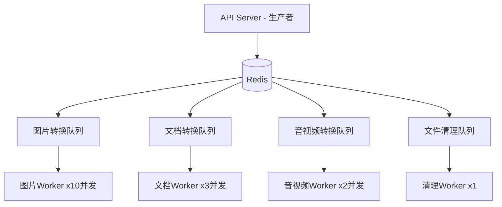

# FileShift 任务队列设计

## 1. 架构概览

### 1.1 队列系统选型：BullMQ

**选型理由**：

- 基于Redis，轻量无需额外组件
- 原生TypeScript支持
- NestJS官方集成 (`@nestjs/bullmq`)
- 支持优先级、延迟任务、重试、死信队列
- 支持进度回报和事件监听

### 1.2 整体架构



---

## 2. 队列配置

### 2.1 队列定义

| 队列名称              | 并发数 | 超时(ms) | 最大重试 | 优先级 |
| --------------------- | ------ | -------- | -------- | ------ |
| `image-conversion`    | 10     | 30,000   | 3        | 支持   |
| `document-conversion` | 3      | 120,000  | 3        | 支持   |
| `media-conversion`    | 2      | 300,000  | 2        | 支持   |
| `file-cleanup`        | 1      | 60,000   | 5        | 不支持 |

### 2.2 NestJS 集成配置

```typescript
// queue.module.ts
import { BullModule } from '@nestjs/bullmq';

@Module({
  imports: [
    BullModule.forRoot({
      connection: {
        host: process.env.REDIS_HOST || 'localhost',
        port: parseInt(process.env.REDIS_PORT) || 6379,
        password: process.env.REDIS_PASSWORD,
      },
      defaultJobOptions: {
        attempts: 3,
        backoff: { type: 'exponential', delay: 5000 },
        removeOnComplete: { age: 3600, count: 1000 },
        removeOnFail: { age: 86400, count: 5000 },
      },
    }),
    BullModule.registerQueue(
      { name: 'image-conversion' },
      { name: 'document-conversion' },
      { name: 'media-conversion' },
      { name: 'file-cleanup' },
    ),
  ],
})
export class QueueModule {}
```

---

## 3. 任务生命周期

### 3.1 状态流转

```
创建 → waiting → active → completed
                    ↓
                 failed → (重试) → active → completed
                    ↓
              (超过重试次数) → dead-letter (死信)
```

### 3.2 任务数据结构

```typescript
interface ConversionJobData {
  taskNo: string; // 任务编号
  userId: number; // 用户ID
  type: string; // 转换类型 (e.g., 'pdf-to-word')
  inputPath: string; // 输入文件路径
  outputDir: string; // 输出目录
  options: Record<string, any>; // 转换参数
  priority: number; // 优先级 (1=最高, 10=最低)
  createdAt: string; // 创建时间
}

interface ConversionJobResult {
  success: boolean;
  outputPath: string;
  outputSize: number;
  duration: number;
  metadata?: Record<string, any>;
}
```

---

## 4. Worker 实现

### 4.1 图片转换 Worker

```typescript
import { Processor, WorkerHost } from '@nestjs/bullmq';
import { Job } from 'bullmq';

@Processor('image-conversion', {
  concurrency: 10,
  limiter: { max: 20, duration: 1000 }, // 每秒最多20个
})
export class ImageWorker extends WorkerHost {
  async process(job: Job<ConversionJobData>): Promise<ConversionJobResult> {
    const { type, inputPath, outputDir, options } = job.data;

    // 更新进度
    await job.updateProgress(10);

    // 获取转换策略
    const strategy = this.strategyFactory.getStrategy(type);

    // 执行转换
    const result = await strategy.convert({
      inputPath,
      outputPath: path.join(outputDir, this.getOutputFileName(job.data)),
      options,
      onProgress: async (percent) => {
        await job.updateProgress(percent);
      },
    });

    return result;
  }
}
```

### 4.2 事件监听

```typescript
// 任务完成后更新数据库
@OnWorkerEvent('completed')
async onCompleted(job: Job, result: ConversionJobResult) {
  await this.taskService.markCompleted(job.data.taskNo, result);
}

// 任务失败后处理
@OnWorkerEvent('failed')
async onFailed(job: Job, error: Error) {
  if (job.attemptsMade >= job.opts.attempts) {
    // 最终失败，退还积分
    await this.creditService.refund(job.data.userId, job.data.taskNo);
    await this.taskService.markFailed(job.data.taskNo, error.message);
  }
}
```

---

## 5. 优先级机制

### 5.1 优先级规则

| 用户类型             | 优先级值 | 说明         |
| -------------------- | -------- | ------------ |
| 付费用户(购买过积分) | 1        | 最高优先处理 |
| 活跃免费用户         | 5        | 正常优先级   |
| 新注册用户           | 5        | 正常优先级   |

### 5.2 实现方式

```typescript
// 创建任务时设置优先级
async createTask(userId: number, data: CreateTaskDto) {
  const user = await this.userService.findById(userId);
  const priority = user.hasPurchased ? 1 : 5;

  await this.queue.add('convert', jobData, {
    priority,
    timeout: this.getTimeout(data.type),
  });
}
```

---

## 6. 重试策略

### 6.1 指数退避配置

```typescript
{
  attempts: 3,
  backoff: {
    type: 'exponential',
    delay: 5000,  // 基础延迟5秒
    // 实际延迟: 5s, 25s, 125s
  }
}
```

### 6.2 重试条件判断

```typescript
// 某些错误不应重试
const NON_RETRYABLE_ERRORS = ['UNSUPPORTED_FORMAT', 'FILE_TOO_LARGE', 'INVALID_FILE'];

// Worker中判断是否重试
if (NON_RETRYABLE_ERRORS.includes(error.code)) {
  throw new UnrecoverableError(error.message); // BullMQ不会重试
}
throw error; // 普通错误会触发重试
```

---

## 7. 死信队列

### 7.1 处理策略

- 超过最大重试次数的任务自动进入死信队列
- 管理后台可查看死信队列任务
- 支持手动重试或永久标记失败

### 7.2 告警机制

- 死信队列积压 > 10个 → 发送告警通知
- 同一类型任务连续失败 > 5次 → 暂停该类型队列，人工排查

---

## 8. 进度推送

### 8.1 方案：SSE (Server-Sent Events)

```typescript
// Controller - SSE端点
@Get('conversions/:taskNo/progress')
@Sse()
async getProgress(@Param('taskNo') taskNo: string): Observable<MessageEvent> {
  return new Observable(subscriber => {
    const interval = setInterval(async () => {
      const status = await this.redis.get(`task:${taskNo}:progress`);
      if (status) {
        const data = JSON.parse(status);
        subscriber.next({ data });
        if (data.status === 'completed' || data.status === 'failed') {
          clearInterval(interval);
          subscriber.complete();
        }
      }
    }, 1000);  // 每秒轮询Redis

    return () => clearInterval(interval);
  });
}
```

### 8.2 Worker 进度上报

```typescript
// Worker中更新进度到Redis
async updateProgress(taskNo: string, progress: number, status: string) {
  await this.redis.set(
    `task:${taskNo}:progress`,
    JSON.stringify({ progress, status, updatedAt: Date.now() }),
    'EX', 3600  // 1小时过期
  );
}
```

---

## 9. 文件清理队列

### 9.1 清理策略

```typescript
// 每小时执行一次
@Cron('0 * * * *')
async scheduleCleanup() {
  await this.cleanupQueue.add('cleanup', {
    expirationHours: 24,
    batchSize: 100,
  }, {
    repeat: { every: 3600000 },
  });
}
```

### 9.2 清理逻辑

1. 查询 `conversion_tasks` 中 `expires_at < NOW()` 的记录
2. 删除对应的输入文件和输出文件
3. 更新任务状态为已清理
4. 批量处理，每批100条

---

## 10. 监控指标

| 指标         | 获取方式                  | 告警阈值    |
| ------------ | ------------------------- | ----------- |
| 队列积压数   | `queue.getWaitingCount()` | > 50        |
| 活跃任务数   | `queue.getActiveCount()`  | > 并发数×2  |
| 失败率       | 失败数/总数               | > 5%        |
| 平均处理时间 | 完成时间-开始时间         | 超过预期2倍 |
| 死信队列大小 | 死信队列count             | > 10        |
