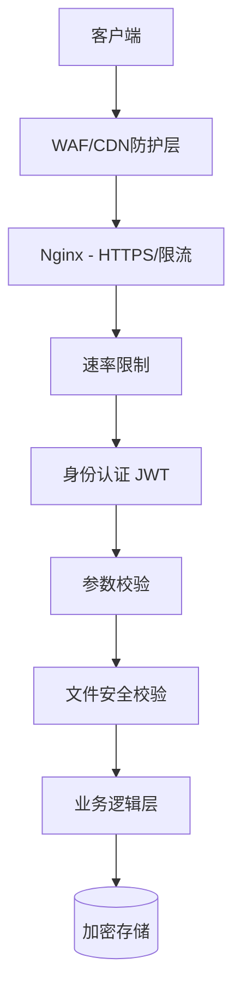

# FileShift 安全方案

## 1. 安全架构总览



---

## 2. 文件安全

### 2.1 上传校验

| 校验项     | 方法               | 说明                               |
| ---------- | ------------------ | ---------------------------------- |
| 文件大小   | Content-Length检查 | 免费用户≤20MB，付费≤100MB          |
| MIME类型   | Magic Number检测   | 读取文件头字节，不信任Content-Type |
| 文件扩展名 | 白名单             | 仅允许已知安全扩展名               |
| 文件名     | 清理特殊字符       | 防止路径穿越攻击                   |
| 文件内容   | 结构校验           | PDF检查header，图片检查尺寸        |

### 2.2 Magic Number 校验

```typescript
const FILE_SIGNATURES: Record<string, Buffer[]> = {
  'application/pdf': [Buffer.from([0x25, 0x50, 0x44, 0x46])], // %PDF
  'image/png': [Buffer.from([0x89, 0x50, 0x4e, 0x47])], // ‰PNG
  'image/jpeg': [Buffer.from([0xff, 0xd8, 0xff])], // ÿØÿ
  'image/gif': [Buffer.from('GIF87a'), Buffer.from('GIF89a')],
  'image/webp': [Buffer.from('RIFF')], // + 偏移8处'WEBP'
  // ... 更多格式
};

function validateFileMagic(buffer: Buffer, expectedMime: string): boolean {
  const signatures = FILE_SIGNATURES[expectedMime];
  if (!signatures) return false;
  return signatures.some((sig) => buffer.slice(0, sig.length).equals(sig));
}
```

### 2.3 文件存储安全

| 措施         | 实现                                          |
| ------------ | --------------------------------------------- |
| 随机文件名   | UUID v4 替换原始文件名                        |
| 目录隔离     | 每个用户独立子目录 `/uploads/{userId}/{uuid}` |
| 禁止目录遍历 | 过滤 `../` 和绝对路径                         |
| 自动清理     | 24小时TTL + 定时清理任务                      |
| 权限控制     | 下载接口验证文件归属                          |

### 2.4 白名单配置

```typescript
export const ALLOWED_MIME_TYPES = {
  document: [
    'application/pdf',
    'application/msword',
    'application/vnd.openxmlformats-officedocument.wordprocessingml.document',
    'application/vnd.ms-excel',
    'application/vnd.openxmlformats-officedocument.spreadsheetml.sheet',
    'application/vnd.ms-powerpoint',
    'application/vnd.openxmlformats-officedocument.presentationml.presentation',
    'text/markdown',
    'text/html',
  ],
  image: [
    'image/png',
    'image/jpeg',
    'image/webp',
    'image/gif',
    'image/bmp',
    'image/tiff',
    'image/svg+xml',
    'image/heic',
    'image/x-icon',
    'image/vnd.microsoft.icon',
  ],
  media: [
    'video/mp4',
    'video/x-msvideo',
    'video/x-matroska',
    'video/quicktime',
    'video/x-flv',
    'audio/mpeg',
    'audio/wav',
    'audio/aac',
    'audio/flac',
    'audio/ogg',
  ],
};
```

---

## 3. 身份认证

### 3.1 JWT 方案

```typescript
// Token结构
{
  "sub": 12345,          // 用户ID
  "email": "user@x.com",
  "role": "user",
  "iat": 1700000000,
  "exp": 1700007200      // 2小时过期
}
```

### 3.2 Token策略

| Token类型     | 有效期 | 存储位置                | 刷新方式                  |
| ------------- | ------ | ----------------------- | ------------------------- |
| Access Token  | 2小时  | 内存/localStorage       | 过期后用Refresh Token刷新 |
| Refresh Token | 7天    | httpOnly Cookie + Redis | 过期后重新登录            |

### 3.3 Token安全措施

- Access Token 短期有效，降低泄露风险
- Refresh Token 存储在 httpOnly Cookie，防XSS
- Refresh Token 单设备唯一，登录后旧Token作废
- Token黑名单：退出登录后将Token加入Redis黑名单

---

## 4. 速率限制 (Rate Limiting)

### 4.1 限流规则

| 维度 | 接口       | 限制  | 窗口   |
| ---- | ---------- | ----- | ------ |
| IP   | 全局       | 100次 | 1分钟  |
| IP   | 登录       | 5次   | 5分钟  |
| IP   | 注册       | 3次   | 10分钟 |
| IP   | 发送验证码 | 3次   | 5分钟  |
| 用户 | 文件转换   | 10次  | 1分钟  |
| 用户 | 文件上传   | 20次  | 1分钟  |

### 4.2 实现方式

```typescript
import { ThrottlerModule, ThrottlerGuard } from '@nestjs/throttler';

@Module({
  imports: [
    ThrottlerModule.forRoot([
      { name: 'short', ttl: 1000, limit: 3 },    // 每秒3次
      { name: 'medium', ttl: 60000, limit: 100 }, // 每分钟100次
      { name: 'long', ttl: 3600000, limit: 500 }, // 每小时500次
    ]),
  ],
})
```

### 4.3 限流响应

```json
{
  "code": 99429,
  "message": "请求过于频繁，请稍后重试",
  "data": { "retryAfter": 30 }
}
```

---

## 5. 接口安全

### 5.1 Helmet 安全头

```typescript
import helmet from 'helmet';

app.use(
  helmet({
    contentSecurityPolicy: true,
    crossOriginEmbedderPolicy: true,
    crossOriginOpenerPolicy: true,
    crossOriginResourcePolicy: true,
    dnsPrefetchControl: true,
    frameguard: { action: 'deny' },
    hidePoweredBy: true,
    hsts: true,
    ieNoOpen: true,
    noSniff: true,
    referrerPolicy: true,
    xssFilter: true,
  }),
);
```

### 5.2 CORS 配置

```typescript
app.enableCors({
  origin: [
    'http://localhost:3000', // 本地开发
    'https://fileshift.cn', // 生产域名
    'https://www.fileshift.cn', // www域名
  ],
  methods: ['GET', 'POST', 'PUT', 'PATCH', 'DELETE'],
  credentials: true,
  maxAge: 86400,
});
```

### 5.3 输入校验

```typescript
import { IsEmail, IsString, MinLength, MaxLength, Matches } from 'class-validator';

export class RegisterDto {
  @IsEmail({}, { message: '邮箱格式不正确' })
  email: string;

  @IsString()
  @MinLength(8, { message: '密码至少8位' })
  @MaxLength(32, { message: '密码最多32位' })
  @Matches(/^(?=.*[a-z])(?=.*[A-Z])(?=.*\d)/, { message: '密码需包含大小写字母和数字' })
  password: string;

  @IsString()
  @Length(6, 6, { message: '验证码为6位' })
  code: string;
}
```

---

## 6. 数据安全

### 6.1 敏感数据处理

| 数据类型   | 处理方式                             |
| ---------- | ------------------------------------ |
| 用户密码   | bcrypt加密 (saltRounds=12)           |
| JWT密钥    | 环境变量，不入代码库                 |
| 数据库密码 | 环境变量                             |
| 第三方密钥 | 环境变量                             |
| 用户手机号 | 数据库存储明文(后续可加密)，日志脱敏 |
| 支付回调   | 验签 + IP白名单                      |

### 6.2 SQL注入防护

- 使用 TypeORM 参数化查询，禁止字符串拼接SQL
- 所有用户输入经过 class-validator 校验

### 6.3 XSS防护

- 前端：React默认转义
- 后端：返回数据中HTML特殊字符转义
- CSP头限制脚本来源

---

## 7. 转换沙箱

### 7.1 隔离策略

| 引擎        | 隔离方式           | 资源限制            |
| ----------- | ------------------ | ------------------- |
| Sharp       | Node进程内         | 内存500MB           |
| LibreOffice | 独立进程           | 内存512MB，CPU 120s |
| FFmpeg      | 独立进程           | 内存1GB，CPU 300s   |
| Tesseract   | Node Worker Thread | 内存256MB           |

### 7.2 超时保护

```typescript
function withTimeout<T>(promise: Promise<T>, ms: number, label: string): Promise<T> {
  const timeout = new Promise<never>((_, reject) => {
    setTimeout(() => reject(new Error(`${label} timeout after ${ms}ms`)), ms);
  });
  return Promise.race([promise, timeout]);
}
```

### 7.3 OOM保护

- Worker进程设置 `--max-old-space-size=512`
- 进程异常退出后自动重启（PM2/Docker restart policy）
- 监控内存使用率，>80%时暂停接收新任务

---

## 8. 日志安全

### 8.1 日志脱敏规则

| 字段     | 脱敏方式      | 示例                 |
| -------- | ------------- | -------------------- |
| 邮箱     | 保留前3后域名 | `use***@example.com` |
| 手机号   | 保留前3后4    | `138****1234`        |
| Token    | 仅显示前8位   | `eyJhbGci...`        |
| 密码     | 完全隐藏      | `******`             |
| 文件路径 | 仅显示文件名  | `document.pdf`       |

### 8.2 审计日志

记录关键操作：

- 用户登录/注册
- 积分变动
- 支付操作
- 管理员操作

---

## 9. 安全检查清单

### 上线前必须完成

- [ ] HTTPS强制启用
- [ ] 所有环境变量已配置（不含默认密码）
- [ ] CORS仅允许生产域名
- [ ] Rate Limiting已生效
- [ ] 文件上传大小限制已配置
- [ ] JWT密钥使用强随机字符串（≥32位）
- [ ] 数据库不允许外网直接访问
- [ ] Redis设置了密码
- [ ] 管理接口有IP白名单或独立鉴权
- [ ] 日志不包含敏感信息
- [ ] 错误信息不暴露内部细节
- [ ] 文件自动清理定时任务正常运行
